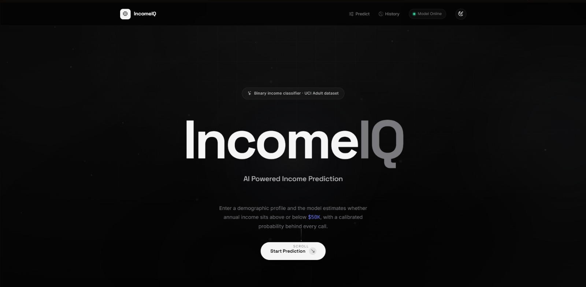
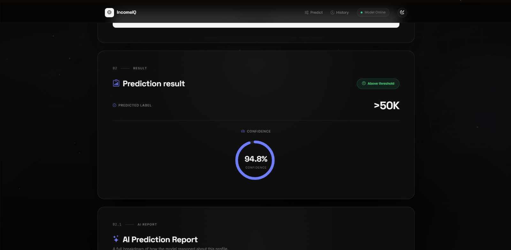
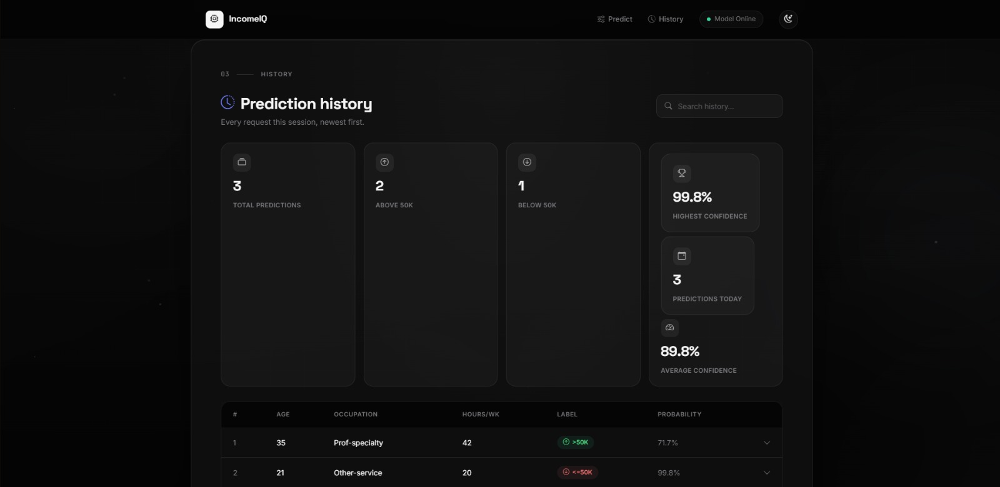

<div align="center">

# IncomeIQ

### AI-Powered Income Prediction Platform

Predict annual income using a production-ready Machine Learning pipeline integrated with Django REST Framework and a modern interactive frontend.

<p align="center">


</p>

</div>

---

## Overview

IncomeIQ is an end-to-end Machine Learning web application that predicts whether an individual's annual income exceeds **$50K** using demographic and employment-related features.

The project combines a trained Scikit-learn pipeline with Django REST Framework to expose prediction APIs, while a modern frontend provides an intuitive interface for generating predictions, viewing confidence scores, and exploring prediction history.

The goal of this project is to demonstrate the complete Machine Learning deployment workflow—from preprocessing and model training to REST API development and frontend integration.

---

## Features

- Machine Learning inference using a trained Scikit-learn pipeline
- Django REST Framework API
- Real-time predictions without page reload
- Probability estimation for every prediction
- Prediction history stored in SQLite
- AI-generated prediction report
- Responsive modern user interface
- Dark & Light theme support
- Input validation
- Modular Django architecture

---

## Technology Stack

| Layer | Technologies |
|--------|--------------|
| Machine Learning | Python, Scikit-learn, Pandas, NumPy, Joblib |
| Backend | Django, Django REST Framework |
| Database | SQLite |
| Frontend | HTML5, CSS3, JavaScript, Bootstrap 5 |
| Development | Git, GitHub, VS Code |

---

## Architecture

```text
                    User
                      │
                      ▼
            Modern Frontend (HTML/CSS/JS)
                      │
             AJAX / Fetch API Request
                      │
                      ▼
          Django REST Framework API
                      │
                      ▼
               inference.py
                      │
                      ▼
          Trained ML Pipeline (.pkl)
                      │
                      ▼
        Prediction + Probability Score
                      │
                      ▼
        SQLite Prediction History
```

---

## Project Structure

```text
IncomeIQ/
│
├── artifacts/
│   └── income_pipeline.pkl
│
├── config/
│
├── frontend/
│   ├── static/
│   │   ├── css/
│   │   ├── js/
│   │   └── images/
│   │
│   └── templates/
│       └── frontend/
│           └── index.html
│
├── predictor/
│
├── inference.py
├── manage.py
├── requirements.txt
├── README.md
└── .env.example
```

---

## Installation

Clone the repository

```bash
git clone https://github.com/<your-username>/IncomeIQ.git
```

Navigate to the project

```bash
cd IncomeIQ
```

Create a virtual environment

```bash
python -m venv venv
```

Activate the environment

### Windows

```bash
venv\Scripts\activate
```

### Linux / macOS

```bash
source venv/bin/activate
```

Install dependencies

```bash
pip install -r requirements.txt
```

Create a `.env` file using `.env.example`

```env
SECRET_KEY=your-secret-key
DEBUG=True
```

Run migrations

```bash
python manage.py migrate
```

Start the development server

```bash
python manage.py runserver
```

Open

```
http://127.0.0.1:8000/
```

---

## REST API

### Predict Income

**POST**

```
/predictor/predict/
```

Example Response

```json
{
    "prediction": 1,
    "label": ">50K",
    "probability": 0.9904
}
```

---

### Prediction History

**GET**

```
/predictor/history/
```

Returns all previously generated predictions.

---

## Screenshots

> Add your screenshots after uploading them to the repository.

```text
screenshots/
│
├── home.png
├── prediction.png
├── ai-report.png
├── history.png
├── api-post.png
└── api-history.png
```

Example

```markdown





```

---

## Machine Learning Pipeline

```text
Raw User Input
        │
        ▼
Input Validation
        │
        ▼
Feature Preprocessing
        │
        ▼
Scikit-learn Pipeline
        │
        ▼
Prediction
        │
        ▼
Probability Score
        │
        ▼
Store Prediction History
```

---

## Roadmap

- Docker support
- PostgreSQL integration
- SHAP Explainability
- Batch prediction
- User authentication
- Cloud deployment
- Model monitoring
- PDF report export

---

## Author

**Kanishk Chahar**

B.Tech Computer Science Engineering

Machine Learning • Artificial Intelligence • Full Stack Development

GitHub: https://github.com/<FANGER7>

LinkedIn: https://linkedin.com/in/kanishk-chahar

---

## License

This project was developed for educational, internship, and portfolio purposes.
